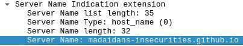
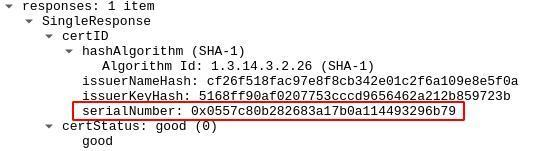
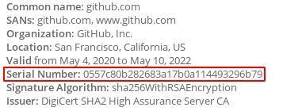

     Encrypted DNS | Madaidan's Insecurities 🌓

Why encrypted DNS is ineffective
================================

_Last edited: March 6th, 2022_

Encrypted DNS ([DoH](https://en.wikipedia.org/wiki/DNS_over_HTTPS), [DoT](https://en.wikipedia.org/wiki/DNS_over_TLS), [DNScrypt](https://en.wikipedia.org/wiki/DNSCrypt), etc.) is often recommended as a solution to some network privacy and security issues, but this is not the case. This article explains why encrypting your DNS queries alone will not have any meaningful privacy or security benefits.

[Security](#security)
---------------------

Normal DNS queries are unencrypted and unauthenticated, so they can be modified and examined by an attacker. This may sound like a big issue, but HTTPS has already solved this problem. If someone visits "madaidans-insecurities.github.io", their browser expects a valid TLS certificate for that website, regardless if an attacker may have messed with the DNS query. If the certificate is incorrect, the browser will produce a clear warning.  
  
If the connection is not done over HTTPS, then encrypted DNS still doesn't make a difference. The attacker can simply modify anything other than the DNS query and achieve effectively the same result.

[Privacy](#privacy)
-------------------

Encrypted DNS does prevent someone monitoring your traffic from seeing what domain you looked up via DNS, but this doesn't really matter since [there](https://twitter.com/PowerDNS_Bert/status/1175744071673028608) [are](https://blog.powerdns.com/2019/09/25/centralised-doh-is-bad-for-privacy-in-2019-and-beyond/) [so](https://grapheneos.org/faq#private-dns-visited) [many](https://arxiv.org/pdf/1911.00563.pdf) [other](https://old.reddit.com/r/GrapheneOS/comments/fajx43/verizon_pixel_how_dangerous_to_install_graphene/fiz0klm/?context=3) [ways](https://www.ndss-symposium.org/wp-content/uploads/2020/02/24301-paper.pdf) to get that exact same information anyway.

### [SNI](#sni)

[Server Name Indication](https://en.wikipedia.org/wiki/Server_Name_Indication) (SNI) is an extension to TLS which leaks the hostname that the client is attemping to connect to. For example, if you connect to this website, someone monitoring the connection can see the following:  
  
  
There have been [efforts to encrypt SNI](https://blog.cloudflare.com/encrypted-client-hello/), which solves this issue, but currently, it's not very widespread.

### [OCSP](#ocsp)

[Online Certificate Status Protocol](https://en.wikipedia.org/wiki/Online_Certificate_Status_Protocol) (OCSP) is used to validate TLS certificates and [is another way to determine the website that you're visiting](https://blog.seanmcelroy.com/2019/01/05/ocsp-web-activity-is-not-private/). OCSP responses contain the serial number of the website's TLS certificate, which can easily be used to lookup what certificate it belongs to.  
   
  
There is also a way to prevent this via [OCSP stapling](https://en.wikipedia.org/wiki/OCSP_stapling), but again, it's not very widespread.

### [IP Addresses](#ip-addresses)

Even if you are using some form of encrypted DNS, eSNI/ECH and OCSP stapling, the IP addresses of the websites you visit are still leaked, and they can be used to identify [over 95% of websites](https://blog.apnic.net/2019/08/23/what-can-you-learn-from-an-ip-address/). Some IP addresses may host multiple domains that can obscure this a small bit, but that's not reliable and won't make any difference in most cases.

[Conclusion](#conclusion)
-------------------------

Encrypting your DNS queries alone is not enough to hide the domains you visit and gives no security advantage. It will only help against some very rudimentary censorship systems that rely entirely on DNS blocking, but it isn't hard for those systems to develop workarounds. If you do want to effectively hide the websites you browse, use a VPN or preferably, Tor.

[Go back](/index.html)