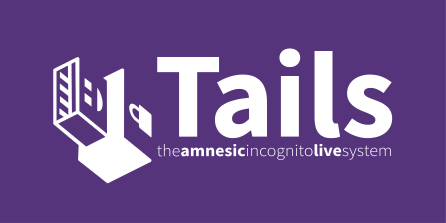
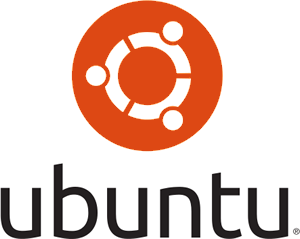

 Privacy Guide

Operating Systems
=================

DO NOT USE:
-----------

Windows (any version)  
MacOS/OSX  
ChromeOS

USE:
----

GNU/Linux  
BSD

Which Linux distros?
--------------------

Most Linux distros will be fine. If you are a beginner to Linux then I'd recommend Ubuntu (see [warning](os.html#ubuntu)), Mint and Manjaro. If you want max privacy then use [Tails](https://tails.boum.org/), [Whonix](https://www.whonix.org/) or [Qubes OS](https://www.qubes-os.org/).

  

But I already use Linux.
------------------------

If you already use Linux then you should harden it as much as you can. Most distros have guides on hardening but they aren't always good.  
  
[Arch Linux Hardening](https://wiki.archlinux.org/index.php/Security)  
[Debian Hardening](https://wiki.debian.org/Hardening)  
[Gentoo Hardening](https://wiki.gentoo.org/wiki/Hardened_Gentoo)  

### Hardening Tips

#### Apparmor

You should always enable apparmor. This limits what a program can do. The script below will automatically enable apparmor for Arch Linux. If you don't use Arch then you need to modify it for your package manager and kernel paramaters.

pacman -S --noconfirm -q apparmor  
sed -i 's/quiet/quiet apparmor=1 security=apparmor audit=1/' /etc/default/grub  
grub-mkconfig -o /boot/grub/grub.cfg  
systemctl enable apparmor  

#### Firejail

Firejail is a very secure and easy to use sandboxing program. It can be used in conjunction with Apparmor by the firejail --apparmor command. Running firecfg will make all programs automatically run in a sandbox if there is a profile for them in /etc/firejail. If you want to make only 1 program automatically run in a sandbox then run ln -s /usr/bin/firejail /usr/local/bin/program.

#### **Hardening Sysctl**

Sysctl is a tool for examining and changing kernel parameters at runtime. It can be used to harden the kernel. To harden it edit /etc/sysctl.conf or if you run Arch create a file called /etc/sysctl.d/99-sysctl.conf and add the sysctl configs in there. My sysctl changes are below.

kernel.dmesg\_restrict=1  
kernel.kptr\_restrict=1  
net.ipv4.tcp\_syncookies=1  
net.ipv4.tcp\_rfc1337=1  
net.ipv4.conf.default.rp\_filter=1  
net.ipv4.conf.all.rp\_filter=1  
net.ipv4.conf.all.accept\_redirects=0  
net.ipv4.conf.default.accept\_redirects=0  
net.ipv4.conf.all.secure\_redirects=0  
net.ipv4.conf.default.secure\_redirects=0  
net.ipv6.conf.all.accept\_redirects=0  
net.ipv6.conf.default.accept\_redirects=0  
net.ipv4.conf.all.send\_redirects=0  
net.ipv4.conf.default.send\_redirects=0  
net.ipv4.icmp\_echo\_ignore\_all=1  
kernel.unprivileged\_bpf\_disabled=1  
net.core.bpf\_jit\_harden=2

#### **Mac Address Spoofing**

Mac Address Spoofing can be done easily by macchanger. Run macchanger -r wlp2s0. Replace wlp2s0 with your network interface. You can find these by running ip a. If you use systemd then you can create a systemd service that randomizes the mac address on boot. It is below.

\[Unit\] Description=macchanger on **wlp2s0**  
Wants=network-pre.target  
Before=network-pre.target  
BindsTo=sys-subsystem-net-devices-**wlp2s0**.device  
After=sys-subsystem-net-devices-**wlp2s0**.device  
  
\[Service\]  
ExecStart=/usr/bin/macchanger -r **wlp2s0**  
Type=oneshot  
  
\[Install\]  
WantedBy=multi-user.target  

  

Replace **wlp2s0** with your network interface. You can use this service for as many interfaces as you want.

Ubuntu Warning
--------------

Many people consider Ubuntu to not be privacy friendly. These claims are justified somewhat as Ubuntu has violated user's privacy in the past such as with the Amazon launcher tracking users or when telemetry was enabled by default. Ubuntu also comes with proprietary software so they could also be tracking you as well. Ubuntu is commercial and owned by a UK company who are part of the 5 eyes. I do not believe Ubuntu is anti-privacy but you should still be aware of this.

  
  

[RETURN](https://theprivacyguide1.github.io/)